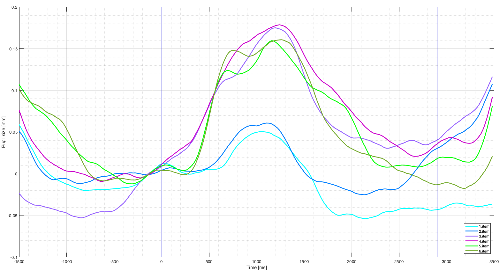

## LCP3 - Lightweight Customisable Processing Pipeline for Pupillometry

This is a little processing pipeline I have been building from scratch for analysing pupillometry data from cognitive science experiments. Recently I started to beautify it and decided to upload it to let other people use it.

Proper documentation and examples will be uploaded in near future, as well as bug fixes, revisions. This is the initial version here. Many small changes will be coming in the next few months.

Currently available functionality is in the following scripts:
PREPROC.m,
CALC_FILTERED_TEPR.m,
GET_TRIALCHANGES.m

This is a little demo plot of one of my analyses made with this pipeline:

The scripts only work with Matlab yet, Octave will probably be supported in the future.

Feel free to message me or open a discussion here if you have any suggestion or noticed a bug.

Author: Gábor Bényei @ BUTE

License: BSD
